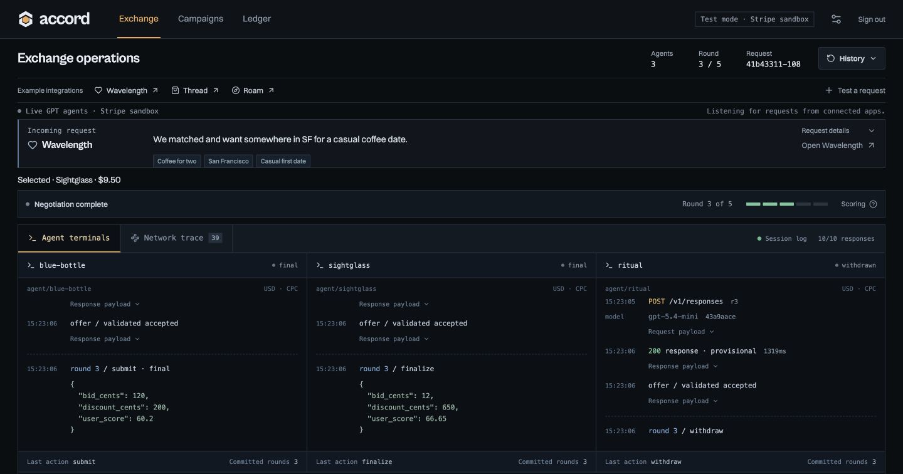
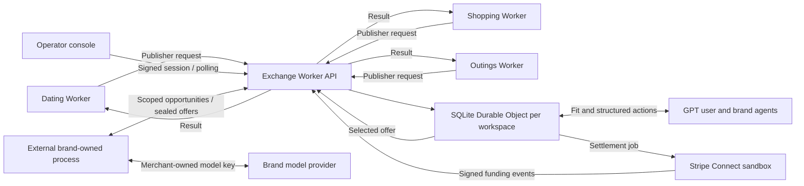

# Accord

### The agent exchange where brands compete to give AI users better deals.

Consumer AI apps are becoming a place where people decide what to buy and where to go. Accord connects those moments of intent to brand agents that negotiate two things: **what they pay the publisher and what they give the customer**.

Each brand submits `{ bid, discount }`. A user agent assesses personal fit before bidding begins; the exchange chooses using that fit and the price after discount. **A brand can lose the cash auction and win the recommendation.**

[Open the exchange](https://accord-agent-exchange.kairosity-main-website.workers.dev/) · [Try the café flow](https://accord-dating-demo.kairosity-main-website.workers.dev/) · [Invite an external brand](docs/EXTERNAL-AGENTS.md) · [Final-round playbook](docs/FINAL-ROUND.md) · [Run locally](docs/SETUP.md)



*An actual persisted GPT negotiation in the deployed operator console, captured September 28, 2026. This screenshot shows the hosted agents. The exchange also accepts offers from invited brand agents running independently outside the exchange.*

## See it work

1. Open the dating app and select **New chat → Find a café for us**.
2. Follow **Open exchange** to inspect that exact request. The console requires an operator session; the consumer apps are publicly accessible examples.
3. Watch **Agent terminals** as the brand agents respond. Open **Network trace** to inspect redacted payloads, response timing, and validation events.
4. Compare the **Public offer board** and **highest cash bid versus user-value winner**. Live rounds use 10-second sealed windows, up to five rounds, with early completion.
5. Return to the consumer tab: the actual selected offer and illustrative code arrive automatically.
6. Click the merchant button within ten minutes. Inspect the exchange receipt for the CPC charge, publisher earnings, and Stripe sandbox transfer status.

The example integration workspace is explicit: follow the consumer's **Open exchange** link. Opening the exchange root signs an operator into their configured private workspace instead. A page refresh does not restart the auction.

## One exchange, three independently deployed apps

| Surface | Request | Competing brand agents |
|---|---|---|
| [Accord](https://accord-agent-exchange.kairosity-main-website.workers.dev/) | Operator console, campaigns, execution traces, ledger | All scenarios |
| [Wavelength-inspired dating](https://accord-dating-demo.kairosity-main-website.workers.dev/) | A casual coffee date in San Francisco | Blue Bottle, Sightglass, Ritual |
| [Thread](https://accord-shopping-demo.kairosity-main-website.workers.dev/) | Everyday women's sneakers | Allbirds, Rothy's, Everlane |
| [Roam](https://accord-outings-demo.kairosity-main-website.workers.dev/) | An outing with art and hands-on science | Exploratorium, California Academy of Sciences, SFMOMA |

The consumer apps share UI code but run as separate Workers, with separate publisher credentials and attribution. They use the same auction and accounting implementation.

## What Accord owns

- **Personalization:** a bid-blind fit assessment, frozen for each request.
- **Negotiation:** simultaneous brand turns against the same previous completed offer board, with private campaign limits.
- **Selection:** transparent scoring, amount validation, early acceptance, and a frozen winner.
- **Attribution and transactions:** CPC reservation, duplicate-safe click accounting, publisher credits, and retryable settlement.
- **Operations:** authenticated console access, campaign versions, persistent state, and inspectable execution records.
- **External participation:** invite-only brand registration, scoped credentials, private bidding opportunities, and authenticated offer submission from a merchant-owned process.

Consumer interfaces and brand templates are reference integrations around that exchange. GPT decides fit and hosted commercial actions; invited external agents can make their own decisions and submit through the same protocol. Deterministic application code validates actions, ranks offers, and moves accounting state.

## Connect an external brand agent

An operator can now invite a new brand through **Campaigns → Invite brand agent**. Registration creates a catalog entry and inactive, unfunded campaign, then issues a token scoped to that brand and workspace. Fund and activate the campaign before starting a fresh auction. For traffic from the three consumer apps, register it in their shared integration workspace.

The merchant runs [the reference client](scripts/external-brand-agent.mjs) on its own machine with its own `OPENAI_API_KEY`. The client polls for its turns, sees its own private policy and the previous completed public board, chooses an action, and sends it to the deployed exchange. The operator can revoke access. There is no hosted-agent fallback for an absent external bidder.

```sh
# Environment contains the invitation token, workspace ID, and merchant's model key.
node scripts/external-brand-agent.mjs --once  # Access check; no bidding
node scripts/external-brand-agent.mjs         # Live GPT decisions and real API offers
```

[Deployed external-agent verification](docs/EXTERNAL-AGENT-VERIFICATION.md) records an accepted live GPT offer from a separate process, consumer attribution, and credential revocation. [External-agent setup and API contract](docs/EXTERNAL-AGENTS.md) covers credentials, funding, deadlines, and retries. `--rules` is a separately labeled deterministic test mode. This is an implemented invitation path, not a claim that a third-party merchant has joined: **no independent merchant pilot has been validated yet**, and payments remain in Stripe test mode.

## The mechanism

```ts
type Offer = {
  bid_cents: number;       // What the advertiser pays for the first click
  discount_cents: number;  // Flat reduction in the customer's quoted price
};
```

All amounts are integer USD cents. The item, base price, catalog facts, campaign version, and fit assessment are frozen at auction creation/assessment.

```text
effective_price = base_price − discount
reference_price = highest initial base price
price_score     = 100 × (1 − effective_price / reference_price)
user_score      = 0.60 × fit_score + 0.40 × price_score
```

The highest user score wins. Exact ties favor the higher advertising bid, then stable brand ID. The reference price stays fixed across rounds. The 60/40 split is an explicit initial policy, not a claim of optimal auction economics.

| Action | Contract |
|---|---|
| Submit/revise | Increase either amount or both; never reduce a prior valid amount |
| Hold | Keep the offer and remain available for later turns |
| Finalize | Keep the offer eligible; receive no further bidding turns |
| Withdraw | Permanently remove the offer from selection |

Round one counts toward the five-round cap. Timeouts and invalid actions retain the previous valid offer. Acceptance during a later round commits the last completed board and discards late changes. Auctions record an explicit ending reason, including acceptance, satisfaction target, all final, no change, maximum rounds, or no offers.

**Economic boundary:** CPC only breaks ties, so a rational brand can offer very little cash. One-cent bids have occurred. A publisher reserve price or fixed placement fee is a planned policy experiment; neither is implemented today. Customer discounts are illustrative and do not create a cashback liability.

## A verified outcome

In a recorded live GPT café auction, three separately funded brands competed:

| Brand | CPC offered | Customer discount | Customer price | User score |
|---|---:|---:|---:|---:|
| **Ritual — selected** | **$0.90** | **$4.50** | **$11.50** | **60.450** |
| Sightglass | $0.90 | $5.21 | $10.79 | 60.425 |
| Blue Bottle | $1.80 | $2.00 | $14.00 | 55.400 |

Ritual won with half the highest advertising bid. Its first click produced one **$0.90 charge**, **$0.72 publisher credit**, and **$0.18 network gross**, followed by a verified Stripe test transfer. A repeated click returned the same accounting entry.

This is a historical outcome, not a prescribed winner or a promise about the next run. [Payment verification](docs/STRIPE-VERIFICATION.md) records separate café, shopping, and outing transfers. Runtime artifacts are local and ignored; the document distinguishes observed results from test coverage.

## Architecture



React, TypeScript, Vite, and Motion power the interfaces. Cloudflare Workers route requests; a SQLite-backed Durable Object coordinates persisted rounds, campaigns, reservations, the ledger, and settlement jobs. Model requests run concurrently outside storage transactions. Alarms resume work from persisted deadlines. The console polls once a second; it is an observer, not the auction runner.

Hosted brand agents execute as independent GPT model turns with private policies. Invited external agents execute in a separate merchant-owned process and submit via the brand-agent API; the provided client uses GPT, matching this project's chosen model stack. The console and optional [read-only CLI subscribers](docs/TERMINALS.md) observe exchange events, while the [external bidding client](scripts/external-brand-agent.mjs) actually submits actions. External model calls stay on the merchant's machine; the exchange records opportunities and submitted actions, not invented provider traces. Provider responses and external submissions remain provisional until validation and round commitment. Credentials and private campaign limits are excluded from public traces; publisher responses exclude traces and private campaign state entirely.

## Payments and access

Selection reserves the winning CPC for ten minutes. Displaying a recommendation does not charge the advertiser. The first click records the debit, 80/20 publisher/network split, and settlement job together. Expired reservations release funds; duplicate clicks, funding events, and transfer retries do not duplicate the charge. Processing fees are recorded separately. A connected-account transfer is not a bank payout.

Remote console access uses a signed, HttpOnly, Secure, SameSite=Strict session lasting eight hours. A configured owner workspace remains separate from the example integration workspace. Each of the three publisher keys is restricted to its publisher and the integration workspace. This is founder/operator access, not a self-service multi-tenant account system.

## Development

Use Node.js 24. See [setup and deployment](docs/SETUP.md) for required credentials, workspace configuration, and the four-server workflow.

```sh
npm ci
# First setup only: copy .dev.vars.example to .dev.vars and configure it.
npm run build:all
npm run dev:all
```

| Local surface | URL |
|---|---|
| Exchange | http://127.0.0.1:8787 |
| Dating | http://127.0.0.1:8788 |
| Shopping | http://127.0.0.1:8789 |
| Outings | http://127.0.0.1:8790 |

```sh
npm run typecheck
npm test
node --test tests/external-agent-client.node-test.mjs
npm run build:all
```

**327 Vitest tests and 7 native Node client tests pass**, including scoring, sealed windows, early acceptance, restart recovery, structured model-output validation, publisher and external-brand isolation, signed sessions, credential revocation, and payment/submission idempotency. External model and Stripe results are documented separately from these automated tests.

## Current scope

The deployed exchange executes real model decisions, persistent state transitions, and Stripe **test-mode** transactions. The consumer apps are reference implementations. Built-in brand identities and sourced catalog facts are real; their campaigns, discounts, marked quotes, and merchant integrations are illustrative. External brand registration accepts operator-reviewed, merchant-supplied catalog data; it does not independently verify ownership or facts. There is no claimed merchant affiliation or redeemable coupon, and no third-party merchant pilot has been validated.

Live-money payments, merchant-authorized promotions, redemption, production abuse controls, individual accounts, broader publisher onboarding, and measured production latency/economics remain work ahead. Full 10-second live rounds currently favor observability over speed. We do not claim those gaps are solved by deploying the product.

## Explore

- [Final-round presentation, improvement priorities, and judge questions](docs/FINAL-ROUND.md)
- [Local setup, deployment, authentication, and API reference](docs/SETUP.md)
- [90-second recording script](docs/RECORDING-SCRIPT.md)
- [Invite and run an external brand agent](docs/EXTERNAL-AGENTS.md)
- [Three live terminal subscribers](docs/TERMINALS.md)
- [Stripe setup](README-STRIPE.md) and [verified settlement results](docs/STRIPE-VERIFICATION.md)
- [Catalog research and source links](docs/SOURCES.md)
- [Historical acceptance audit](docs/ACCEPTANCE.md) — dated evidence; the UI/auth description predates the terminal redesign
